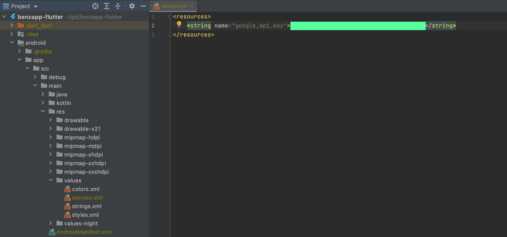
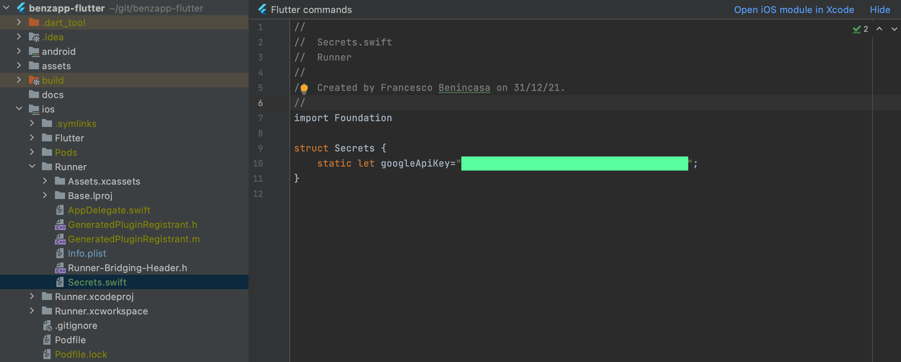

# Flutter Benzapp

Benzapp's Flutter implementation

## Configurazione dei progetti

Per poter eseguire l'applicazione a partire dal codice sorgente disponibile in questo repo è
necessario configurare le chiavi relative ai servizi Google e Firebase utilizzati. Nei file di
esempio, verrà utilizzato il placeholder `${google-api-key}` per indicare dove inserire tale chiave.

## Configurazione sotto-progetto Android

Bisogna creare il file `android/app/src/main/res/values/secrets.xml` nel quale inserire la chiave
per i servizi Google maps per il progetto Android.

```xml

<resources>
    <string name="google_api_key">${google-api-key}</string>
</resources>
```



## Configurazione sotto-progetto IOS

Bisogna creare il file `ios/Runner/Secrets.swift` nel quale inserire la chiave per i servizi Google
maps per il progetto iOS.



```swift
import Foundation

struct Secrets {
    static let googleApiKey="${google-api-key}>";
}
```

## Release build per Play store

Per ottenere il file bundle per la pubblicazione dell'applicativo sullo store di Google è
sufficiente eseguire il

```shell
flutter build appbundle
```

## Getting Started

This project is a starting point for a Flutter application.

A few resources to get you started if this is your first Flutter project:

- [Lab: Write your first Flutter app](https://flutter.dev/docs/get-started/codelab)
- [Cookbook: Useful Flutter samples](https://flutter.dev/docs/cookbook)

For help getting started with Flutter, view our
[online documentation](https://flutter.dev/docs), which offers tutorials, samples, guidance on
mobile development, and a full API reference.

## Generate generate_value

```
flutter packages pub get


flutter packages pub run build_runner build
flutter packages pub run build_runner build --delete-conflicting-outputs

flutter packages pub run build_runner watch

```

## Used packages

Widgets catalog:

- https://docs.flutter.dev/development/ui/ui

Material icons:

- https://fonts.google.com/icons?selected=Material+Icons&icon.query=refresh

A Flutter plugin to share images between Flutter and Android.

- https://pub.dev/packages/drawable
- https://github.com/ueman/drawable

## Dipendency Injection

- https://pub.dev/packages/get_it

## Widgets

- https://api.flutter.dev/flutter/material/CircularProgressIndicator-class.html
- https://stackoverflow.com/questions/52376287/positioning-a-widget-in-the-end-of-the-row-widget
- https://www.elitechsystems.com/flutter-numberpad-widget-without-any-package-for-android-ios/
- https://stackoverflow.com/questions/49991444/create-a-rounded-button-button-with-border-radius-in-flutter
- https://stackoverflow.com/questions/51304568/scaffold-of-called-with-a-context-that-does-not-contain-a-scaffold

## Persistence layer

- https://docs.flutter.dev/cookbook/persistence/sqlite
- https://levelup.gitconnected.com/room-database-equivalent-for-flutter-807c9729b58d
- https://pub.dev/packages/floor#data-changes
- https://levelup.gitconnected.com/top-5-local-database-solutions-for-flutter-development-6351cd494070

## Providers

- https://pub.dev/packages/provider
- https://docs.flutter.dev/development/data-and-backend/state-mgmt/simple

## Tab

- https://stackoverflow.com/questions/53956931/how-to-change-color-of-tabs-icon-in-selected-and-unselected-state-in-flutter

## Navigation

- https://docs.flutter.dev/cookbook/navigation/named-routes
- https://docs.flutter.dev/cookbook/navigation/navigate-with-arguments

## Build problems

- https://stackoverflow.com/questions/64574620/target-of-uri-doesnt-exist-packageflutter-gen-gen-l10n-gallery-localizations

## Google map

- https://codelabs.developers.google.com/codelabs/google-maps-in-flutter#0
- https://github.com/flutter/samples/tree/master/place_tracker
- https://coletiv.com/blog/how-to-cluster-markers-on-google-maps-using-flutter/
- https://pub.dev/packages/google_maps_flutter/install
- https://pub.dev/packages/google_maps_cluster_manager
- https://github.com/bpillon/google_maps_cluster_manager

- https://pub.dev/packages/maps_launcher/install

## Gestione dei secret secret-gradle-plugin

- https://github.com/google/secrets-gradle-plugin

## ListView

- https://medium.com/@dev.n/the-complete-flutter-series-article-3-lists-and-grids-in-flutter-b20d1a393e39

## Drawer

- https://docs.flutter.dev/cookbook/design/drawer

## HTTP

- https://pub.dev/packages/dio
- https://pub.dev/packages/pretty_dio_logger/install

## Object to JSON and viceversa

`flutter packages pub run build_runner build`

- https://stacksecrets.com/flutter/introduction-to-built_value-library-in-dart
- https://stacksecrets.com/flutter/how-to-use-built_value-library
- https://stacksecrets.com/flutter/how-to-use-built_value-library#Setup_Built_Value_In_Flutter_App
  https://newbedev.com/dart-built-value-deserialize-list-of-objects

## async await and lint

- https://betterprogramming.pub/how-to-use-async-await-in-flutter-the-flutter-event-loop-97c696caf912

# ORM e Room equivalent

- https://pub.dev/packages/floor#data-changes
- https://levelup.gitconnected.com/room-database-equivalent-for-flutter-807c9729b58d

## Remote config

- https://firebase.flutter.dev/docs/remote-config/overview/

## Firebase

Richiede installazione Firebase CLI.

- https://firebase.google.com/docs/cli#install-cli-windows
- https://firebase.flutter.dev/docs/overview/#initializing-flutterfire
- https://www.woolha.com/tutorials/flutter-using-firebase-remote-config
- https://stackoverflow.com/questions/66830661/firebase-messaging-onbackgroundmessage-local-notifications

## FCM

- https://pub.dev/packages/firebase_messaging/install
- https://firebase.flutter.dev/docs/messaging/usage
- https://pub.dev/packages/flutter_local_notifications/install

### SharePreference

- https://pub.dev/packages/shared_preferences

## Books

https://docs.flutter.dev/resources/books

## Offuscamento

- https://docs.flutter.dev/deployment/obfuscate

## Test

- https://docs.flutter.dev/cookbook/testing/unit/introduction

## Multithread

- https://medium.com/flutter-community/flutter-threading-5c3a7b0c065f
- https://www.tutorialspoint.com/dart_programming/dart_programming_concurrency.htm
- https://pub.dev/packages/threading

## Test

- https://docs.flutter.dev/cookbook/testing/unit/introduction

## Multithread

- https://medium.com/flutter-community/flutter-threading-5c3a7b0c065f
- https://www.tutorialspoint.com/dart_programming/dart_programming_concurrency.htm
- https://pub.dev/packages/threading

## Secure storage

KeyStore was introduced in Android 4.3 (API level 18). The plugin wouldn't work for earlier versions

- https://pub.dev/packages/flutter_secure_storage

## Avatar images

- https://stackoverflow.com/questions/53513456/flutter-network-image-does-not-fit-in-circular-avatar

## QRCode

- https://pub.dev/packages/qr_flutter/

## Textstyle

- https://medium.com/flutter-community/flutter-apply-style-as-a-theme-in-a-text-widget-90268328bd23

## PlusPlugins

- https://plus.fluttercommunity.dev/docs/overview

## File

- https://programmingwithswift.com/how-to-save-a-file-locally-with-flutter/

## Animation

- https://vignesh-prakash.medium.com/flutter-image-rotate-animation-6b6eaed7fb33

### Build per ios
https://fluttercorner.com/warning-the-ios-deployment-target-iphoneos_deployment_target-is-set-to-8-0/